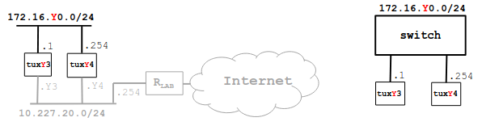

# Configure an IP Network

## Context
Context:
Bench: 1
Image:


## Steps
1. Connect E1 of tuxY3 and E1 of tuxY4 to the switch
2. Configure eth1 interface of tuxY3 and eth1 interface of tuxY4 using ifconfig and route commands
3. Register the IP and MAC addresses of the network interface
4. Use ping command to verify connectivity between these computers
5. Inspect forwarding (route -n) and ARP (arp -a) tables
6. Delete ARP table entries in tuxY3 (arp -d ip address)
7. Start Wireshark in tuxY3.eth1 and start capturing packets
8. In tuxY3, ping tuxY4 for a few seconds
9. Stop capturing packets
10. Save the log and study it at home


### Steps 1
Manually connect E1 of tuxY3 and E1 of tuxY4 to the switch. 

### Steps 2 and 3
On tux3:
```bash
ifconfig eth0 up
ifconfig eth0 172.16.10.1/24
ifconfig eth0
```

On tux4:
```bash
ifconfig eth0 up
ifconfig eth0 172.16.10.254/24
ifconfig eth0
```

On terminal:
```bash
ifconfig
```
| IP | MAC | tux/ether |
| --- | --- | --- | 
| 172.16.10.1 | TODO | tux23 eth0 |
| 172.16.10.252 | TODO | tux24 eth0 |

### Steps 4
On tux3:
```bash
ping 172.16.10.254
```
-> Receives packets from this address

On tux4:
```bash
ping 172.16.10.1
```
-> Receives packets from this address

### Steps 5
On pc terminal:
```bash
route -n
```
-> Maps an IP address to a specfic port to determinae the appropriate route for traffic

On pc terminal:
- Destination: 172.16.10.0
- Iface eth0
```bash
arp -a
```
-> Output: ? (172.16.10.254) at 00:c0:df:04:20:9 [ether] on eth1

### Steps 6

On tux3
```bash
arp -d 172.16.10.254
arp -a
```
-> Output: Empty

### Steps 7-10
- Open Wireshark in tuxY3 eth1
- Start capturing packets
- On tux13, ping tux14
- Stop capturing packets
- Save log - exp1.pcapng


## Questions

**What are the ARP packets and what are they used for?**
ARP (Address Resolution Protocol) packets map IP addresses to MAC addresses. They enable devices on the same network to communicate by identifying hardware addresses for IP-based routing.

**What are the MAC and IP addresses of ARP packets and why?**
ARP packets include:
Sender's MAC and IP addresses (who is making the request).
Target IP address (who the request is for).
MAC is necessary for Layer 2 communication, and IP is required for Layer 3 communication

**What packets does the ping command generate?**
The ping command generates ICMP Echo Request packets, and the response is an ICMP Echo Reply.

**What are the MAC and IP addresses of the ping packets?**
Source IP: IP address of the sending machine.
Destination IP: IP address of the target machine.
Source MAC: MAC of the sending interface.
Destination MAC: MAC of the receiving interface

**How to determine if a receiving Ethernet frame is ARP, IP, ICMP?**
Inspect the EtherType field in the Ethernet frame:
0x0806: ARP
0x0800: IPv4
ICMP packets are identified within IPv4 (Protocol field = 1).

**How to determine the length of a receiving frame?**
Frame length can be viewed in packet capture tools like Wireshark or calculated from the frame header in raw data

**What is the loopback interface and why is it important?**
The loopback interface (commonly lo with IP 127.0.0.1) is a virtual network interface used for testing and local communication.
