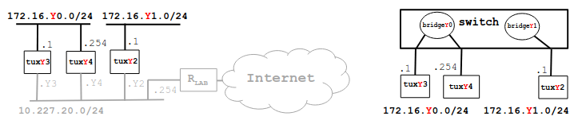

# Implement two bridges in a switch

## Context
Context:
Bench: 1
Image:

## Steps
1. Connect and configure E1 of tuxY2 and register its IP and MAC addresses
2. Create two bridges in the switch: bridgeY0 and bridgeY1
3. Remove the ports where tuxY3, tuxY4 and tuxY2 are connected from the default bridge (bridge) and add them the corresponding ports to bridgeY0 and bridgeY1
4. Start the capture at tuxY3.eth1
5. In tuxY3, ping tuxY4 and then ping tuxY2
6. Stop the capture and save the log
7. Start new captures in tuxY2.eth1, tuxY3.eth1, tuxY4.eth1
8. In tuxY3, do ping broadcast (ping -b 172.16.Y0.255) for a few seconds
9. Observe the results, stop the captures and save the logs
10. Repeat steps 7, 8 and 9, but now do
    - ping broadcast in tuxY2 (ping -b 172.16.Y1.255)

### Steps 1

### Steps 2

### Steps 3

### Steps 4

### Steps 5

### Steps 6

### Steps 7

### Steps 8

### Steps 9

### Steps 10

## Questions

**How to configure bridgeY0?**
TODO

**How many broadcast domains are there? How can you conclude it from the logs?**
TODO

