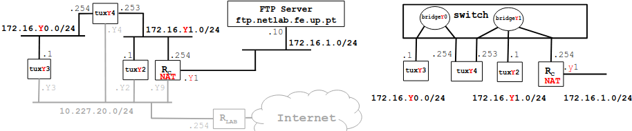

# Configure an IP Network

## Context
Context:
Bench: 1
Image:

## Steps
1. Connect ether1 of RC to the lab network on PY.12 (with NAT enabled by default) and ether2 of RC to a port on bridgeY1. Configure the IP addresses of RC through the router serial console
2. Verify routes
    - tuxY4 as default router of tuxY3;
    - RC as default router for tuxY2 and tuxY4
    - in tuxY2 and RC add routes for 172.16.Y0.0/24
3. Using ping commands and Wireshark, verify if tuxY3 can ping all the network interfaces of tuxY2, tuxY4 and RC
4. In tuxY2
    - Do the following:
        - sysctl net.ipv4.conf.eth0.accept_redirects=0
        - sysctl net.ipv4.conf.all.accept_redirects=0
    - remove the route to 172.16.Y0.0/24 via tuxY4
    - In tuxY2, ping tuxY3
    - Using capture at tuxY2, try to understand the path followed by ICMP ECHO and ECHO-REPLY packets (look at MAC addresses)
    - In tuxY2, do traceroute tuxY3
    - In tuxY2, add again the route to 172.16.Y0.0/24 via tuxY4 and do traceroute tuxY3
    - Activate the acceptance of ICMP redirect at tuxY2 when there is no route to 172.16.Y0.0/24 via tuxY4 and try to understand what happens
5. In tuxY3, ping the FTP server (172.16.1.10) and try to understand what happens
6. Disable NAT functionality in router RC
7. In tuxY3 ping 172.16.1.10, verify if there is connectivity, and try to understand what happens

### Steps 1

### Steps 2

### Steps 3

### Steps 4

### Steps 5

### Steps 6

### Steps 7

## Questions

**How to configure a static route in a commercial router?**
TODO

**What are the paths followed by the packets, with and without ICMP redirection enabled, in the experiments carried out and why?**
TODO

**How to configure NAT in a commercial router?**
TODO

**What does NAT do?**
TODO

**What happens when tuxY3 pings the FTP server with the NAT disabled? Why?**
TODO
