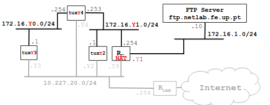

# Configure an IP Network

## Context
Context:
Bench: 1
Image:

## Steps
1. Configure DNS at tuxY3, tuxY4, tuxY2 (use DNS server services.netlab.fe.up.pt (10.227.20.3))
2. Verify if names can be used in these hosts (e.g., ping hostname, use browser)
3. Execute ping (new-hostname-in-the-Internet); observe DNS related packets in Wireshark

### Steps 1

### Steps 2

### Steps 3

## Questions

**How to configure the DNS service in a host?**
todo

**What packets are exchanged by DNS and what information is transported?**
todo
