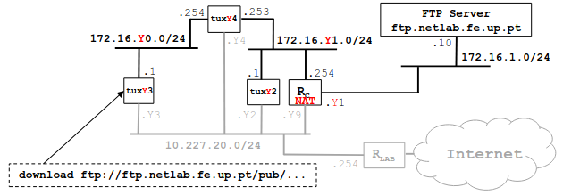

# Configure an IP Network

## Context
Context:
Bench: 1
Image:

## Steps
1. Compile your download application in tuxY3
2. In tuxY3, restart capturing with Wireshark and run your application
3. Verify if file has arrived correctly, stop capturing and save the log
4. Using Wireshark, observe packets exchanged including:
    - TCP control and data connections, and its phases (establishment, data, termination)
    - Data transferred through the FTP control connection
    - TCP ARQ mechanism
    - TCP congestion control mechanism in action
    - Note: use also the Wireshark Statistics tools (menu) to study the TCP phases, ARQ and congestion control mechanism
5. Repeat the download in tuxY3 but now, in the middle of the transfer, start a new download in tuxY2
    - Use the Wireshark statistics tools to understand how the throughput of a TCP connection varies along the time

### Steps 1

### Steps 2

### Steps 3

### Steps 4

### Steps 5

## Questions

**How many TCP connections are opened by your FTP application?**
TODO

**In what connection is transported the FTP control information?**
TODO

**What are the phases of a TCP connection?**
TODO

**How does the ARQ TCP mechanism work? What are the relevant TCP fields?**
TODO

**What relevant information can be observed in the logs?**
TODO

**How does the TCP congestion control mechanism work? What are the relevant fields. How did the throughput of the data connection evolve along the time? Is it according to the TCP congestion control mechanism?**
TODO

**Is the throughput of a TCP data connection disturbed by the appearance of a second TCP connection? How?**
TODO
